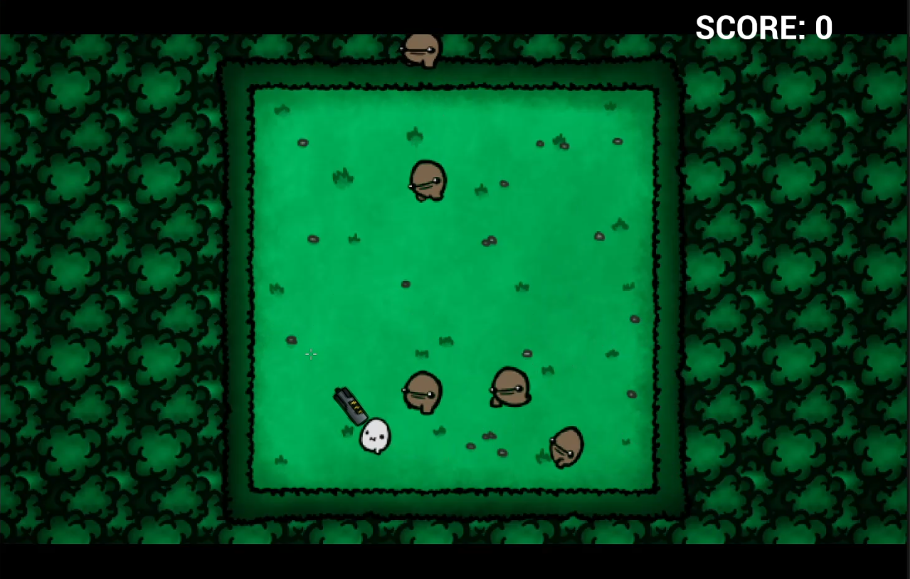
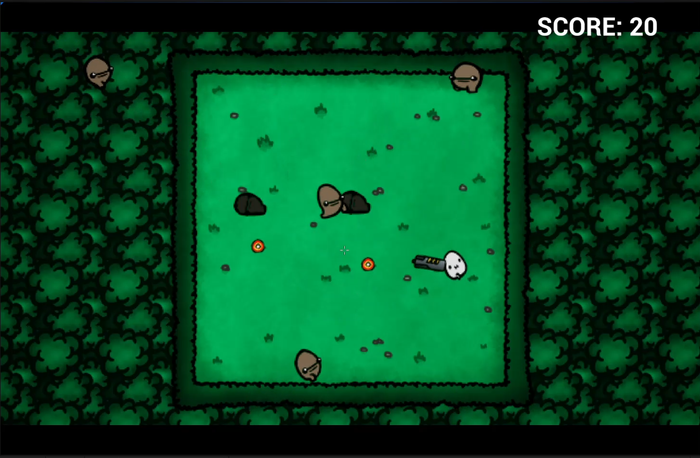
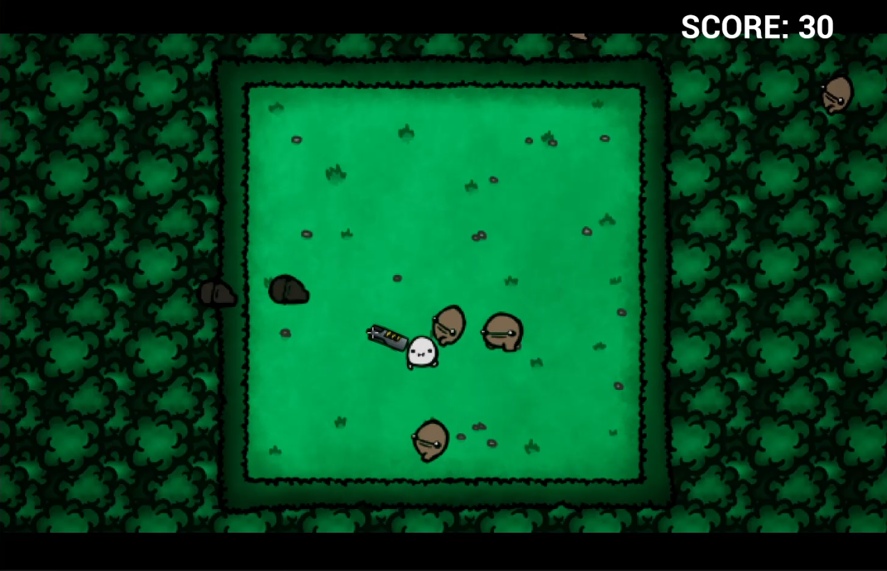

# GunSurvivors

Basic 2D shooter game made following the [Unreal Engine 2D Course](https://www.udemy.com/course/unreal-engine-2d) from [GameDevTV](https://www.gamedev.tv/)

## Gameplay Overview

### Spawn Eenemies
The game generates enemies that follow the player. Every 10 enemies, the spawn speed increases by 0.05%

### Rules
The player can shoot to kill the enemies.Every killed enemy grants 10 points. The score is updated in the top right corner.

### Game Over
The game finishes if one of the enemies manage to reach the player

